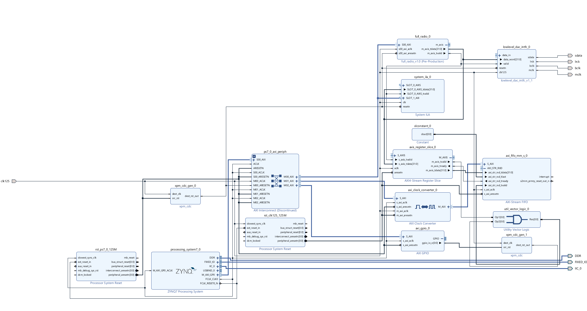

# Software Defined Radio on ZYBO Z7

📡 A complete **Software Defined Radio (SDR)** implemented on the **Zybo Z7 (Zynq-7000)** FPGA + ARM SoC platform.  
This project integrates **FPGA-based DSP, AXI interconnects, Linux on ARM, and a web interface** to create a tunable real-time radio system with audio output.  

---

## 🔎 System Overview

1. **Signal Acquisition**  
   - Input sampled via **ADC AD9467** interface.  
   - Data enters FPGA programmable logic (PL).  

2. **Frequency Tuning**  
   - Tuning signal generated by **DDS (Direct Digital Synthesizer)**.  
   - Frequency selected via a **web interface** served by the PS (ARM core) running Linux + `httpd -p 8080`.  
   - PS communicates tuning data to the **Complex Multiplier** over **AXI interconnect/AXI-Stream/AXI-GPIO**.  

3. **Digital Downconversion (DDC)**  
   - Complex multiplier mixes input signal with DDS.  
   - Outputs fed into **two-stage FIR_compiler** (separate for real and imaginary paths).  
   - Decimation applied (fractional rate, `2^37` in this configuration).  

4. **Digital-to-Analog Output**  
   - Real signal → upper 16 bits of DAC input.  
   - Complex signal → lower 16 bits of DAC input.  
   - Output routed through **DAC interface → CODEC** via `sdata`, `lrck`, `bclk`, `mclk`.  
   - Final audio delivered on **Zybo Z7 audio jack**.  

---

## 🖥️ Block Diagram

  
*(Vivado block diagram of the Zynq-7000 PS + PL integration)*  

---

## ✨ Features

- Real-time SDR pipeline from **ADC → FPGA DSP → DAC → Audio output**  
- **Web-based tuner** (control radio frequency via browser over LAN)  
- FPGA-accelerated DSP:
  - Complex multiplication  
  - Multi-stage FIR filtering  
  - Decimation for bandwidth reduction  
- Integration of **Linux user space + ARM PS + FPGA PL** via AXI  
- Output through onboard **audio CODEC + headphone jack**  

---

## 🚀 Technologies

- **Hardware**: Xilinx Zybo Z7 (Zynq-7000 SoC), AD9467 ADC, onboard DAC/CODEC  
- **FPGA Design**: Vivado IP Integrator, Verilog/VHDL, FIR Compiler, AXI Interconnect  
- **Software**: Linux (Petalinux on Zynq PS), `httpd` for web control  
- **Interfaces**: AXI-Stream, AXI-GPIO, AXI4-Lite, DDR, I²S Audio  
- **Languages**: Verilog, C, Python (optional for web UI)  

---

## 🛠️ Getting Started

### Prerequisites
- Xilinx Vivado (2019.2 or later recommended)  
- PetaLinux for Zynq PS boot image  
- Zybo Z7 board + AD9467 interface  

### Steps
1. Clone the repository:
   ```bash
   git clone https://github.com/qiandawg/software-defined-radio.git
   cd software-defined-radio
